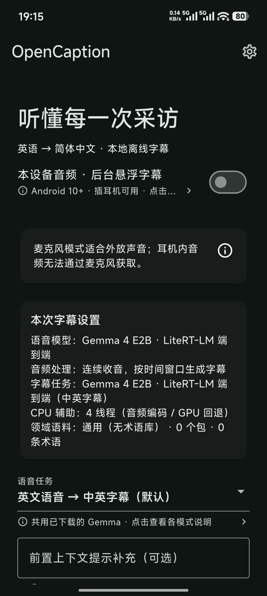
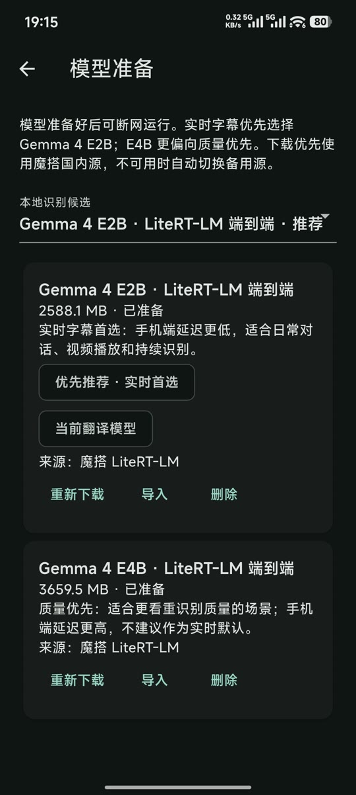
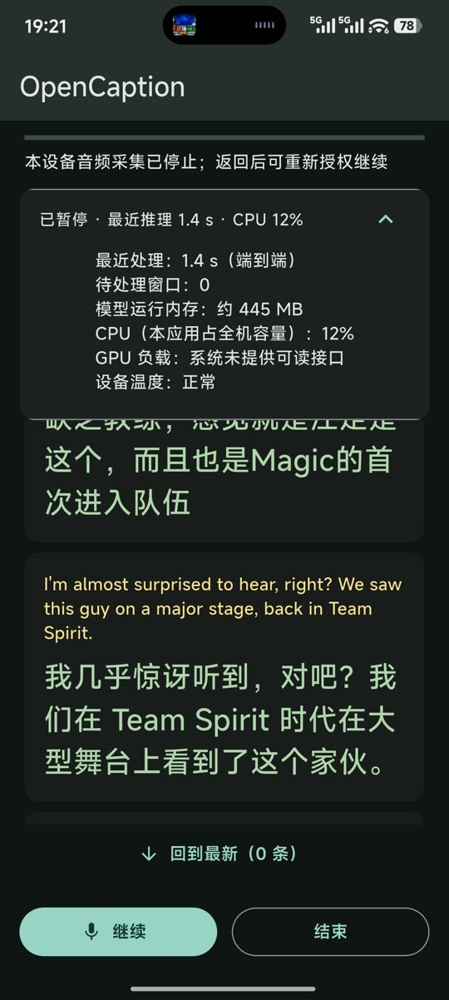

<p align="center">
  
</p>

# OpenCaption

[English](README.md) · [文档导航](docs/README.md) · [许可证](LICENSE)

本地优先的 Android 实时字幕应用。主线使用 Flutter 界面、Kotlin 音频与任务调度，以及 LiteRT Community 的 Gemma 4 LiteRT-LM 端到端模型。主要场景是电脑、电视或手机播放英文采访时，在手机上实时显示英文原文和简体中文字幕；应用也保留中文转写、自动语言识别和旧级联路线用于验证。

当前是开发评测版，模型质量、长时间稳定性、功耗和不同 Android 设备兼容性尚未完成发布验收。Release mode APK 仍使用本地开发签名，适合测试安装，不是应用商店发布包。

## 截图

<table>
  <tr>
    <td align="center"></td>
    <td align="center"></td>
    <td align="center"></td>
  </tr>
  <tr>
    <td align="center">会话设置</td>
    <td align="center">离线模型</td>
    <td align="center">实时字幕</td>
  </tr>
</table>

## 当前推荐

`gemmaE2E` 是下一步 Android 方向，默认和优先推荐 Gemma 4 E2B：

- LiteRT-LM Android `0.17.0`，模型来自 `litert-community` 的 `.litertlm` 包。
- Android 优先使用 GPU，失败后回退 CPU；音频编码使用 CPU。
- E2B/E4B 均启用 LiteRT-LM MTP/speculative decoding，`maxNumTokens=768`，最大输出 128 token，使用应用 cache 目录。
- CPU 辅助线程默认 4，可选 2、4、6、8；GPU 和 CPU 回退使用同一组应用线程设置。
- 手机实测：E2B 推理约 600 ms～1.6 s，适合实时字幕；E4B 约 2.6 s～6 s，作为质量优先的手动选项，不作为实时默认。

上述手机延迟是当前设备上的观察范围，不是跨设备保证；应同时记录模型准备时间、队列等待、RTF、内存、温度和丢段情况。

## 构建变体与模型路线

| 变体 | 当前定位 | 实现 | 建议 |
| --- | --- | --- | --- |
| `gemmaE2E` | 主线 | LiteRT-LM Gemma 4 E2B/E4B，单模型完成语音理解、转写和中文输出 | 默认使用 |
| `cascade` | 兼容／历史评测 | whisper.cpp 识别，再接 ML Kit 或 GGUF 本地翻译 | 不作为下一步主线 |
| `qwenE2E` | 实验路线 | Qwen Omni MNN 端到端 | 仅在专门实验时使用 |

仓库仍保留 cascade 的 whisper.cpp／llama.cpp 原生代码和 Qwen GGUF 清单，以便兼容旧 APK 与历史对照；新模型和下一步主线不再扩展 llama.cpp 路线。Gemma 主线不加载 Whisper、Silero 或独立翻译模型。

### 模型用途

模型准备页会显示用途文案、大小、就绪状态、当前来源、推荐标识和校验状态。当前目录包括：

- Gemma 4 E2B（约 2.59 GB）：实时字幕首选，默认模型。
- Gemma 4 E4B（约 3.66 GB）：质量优先，手机延迟更高。
- Whisper `small.en`／`base.en`：英文专用的旧级联识别候选，不适合中文或通用多语言输入。
- Qwen2.5 0.5B、Qwen3.5 0.8B：旧级联本地翻译实验；Qwen3.5 在本机真实 cgroup 限制下出现内存问题，暂不作为下一方向。
- Qwen Omni 3B MNN：旧的端到端实验变体。
- NLLB-200：当前运行时不支持 encoder-decoder，禁止下载和选择。

TranslateGemma 4B 当前没有进入目录：官方 LiteRT Community 文件是面向 MediaPipe Web 的 `.task`，不是 LiteRT-LM 可加载的 `.litertlm` 包，不能与 Gemma E2E 直接替换。

## 当前使用方式

1. 安装对应 flavor 的 APK，进入“准备与管理模型”。下载或导入模型时会检查文件大小和 SHA-256；下载失败会保留断点并切换预置来源。
2. Gemma E2E 默认选择 E2B。首页可选择语音任务：英文→中英字幕、自动识别语言→中文＋原文、仅英文转写、仅中文转写。
3. 输入方式可选：
   - 麦克风：手机靠近电脑或电视外放，耳机内声音无法通过麦克风获取。
   - 本设备音频：Gemma flavor 支持 Android 10+ 播放音频捕获和悬浮字幕，需要系统授权、悬浮窗权限及目标 App 允许共享音频；不录制画面，部分 DRM、通话或目标 App 会禁止采集。
4. 可填写不超过 240 字符的场景／专名上下文。内容会经过控制字符和提示注入过滤，只作为不可信数据提供给模型。
5. 术语库默认是“通用（无术语库）”；选择 CS2 后才启用 CS2 术语，动态提示最多取少量近期已确认内容，不会把整张词表送入模型。
6. 设置支持浅色、深色和跟随系统，默认跟随系统；可调字幕字号、原文／译文颜色、悬浮字幕透明度和 CPU 辅助线程。

Gemma 端到端路径使用固定 5 秒音频窗口、无重叠、串行推理；窗口积压时会替换尚未开始的旧窗口，避免延迟无限增长。暂停、结束、切后台、温度过高、内存压力或音频授权被撤销时，应用会停止或中止当前任务并显示状态。

## 隐私与已知边界

- 默认识别和字幕处理都在设备内完成，不上传音频；字幕只保留在当前会话，返回首页后清除。
- 当前产品构建默认隐藏外部文本翻译入口。代码保留未来启用的 Chat Completions 兼容协议、HTTPS 默认和安全存储配置，但不能把它当作当前可用功能。
- 模型首次下载需要网络；ML Kit 语言包由 Google SDK 管理，应用不能替换其下载源。离线测试应在模型准备完成后开启飞行模式。
- Debug 测试包默认开启诊断面板，并在 Android 公共 `Downloads` 写入时间命名日志；Release mode 默认关闭诊断和日志。日志不记录音频、字幕、API Key 或完整模型路径。
- 当前 APK 尚未完成 3×60 分钟无崩溃、功耗、温升、保留集质量和多机兼容验收；不要把单次金标结果或手机延迟范围当作发布承诺。

## 开发环境

项目约定的非仓库路径：

- JDK 17：`~/Tools/java/eclipse-temurin-jdk17`
- LiteRT-LM 公共环境和模型：`~/Tools/litert`
- 音频、金标和运行日志：`~/Downloads/opencaption`

项目自带 Flutter wrapper 使用 `.tools/flutter` 和隔离的 `.pub-cache`／Gradle cache。当前工具链为 Flutter 3.47.2、Dart 3.13.2、JDK 17、Android SDK 36、NDK 28.2.13676358、CMake 3.22.1；最低 Android API 28，仅构建 `arm64-v8a`。

```bash
export OPENCAPTION_JAVA_HOME="$HOME/Tools/java/eclipse-temurin-jdk17"
python3 scripts/fetch_native.py
scripts/flutterw pub get
scripts/flutterw analyze --no-pub
scripts/flutterw test --no-pub
```

原生引擎版本固定在 `native.lock.json`；修改 `pigeons/engine.dart` 后重新生成桥接代码：

```bash
PUB_CACHE="$PWD/.pub-cache" .tools/flutter/bin/dart --suppress-analytics \
  run pigeon --input pigeons/engine.dart
```

## 构建 APK

构建脚本强制 arm64，并校验固定签名指纹，避免覆盖安装时因签名变化丢失应用私有模型：

```bash
# Debug：默认开启诊断指标和测试日志
scripts/build-apk gemmaE2E

# Release mode：关闭诊断；仍是本地测试签名，不是商店发布包
OPENCAPTION_BUILD_MODE=release \
OPENCAPTION_DIAGNOSTICS=false \
scripts/build-apk gemmaE2E
```

也可以构建 `cascade` 或 `qwenE2E`。输出位于 `build/app/outputs/flutter-apk/`。release 暂不启用 R8／资源缩减，因为 LiteRT-LM 的反射和原生绑定仍需先补齐 keep 规则并实机验证。测试和构建请串行执行；不要同时加载多个大型模型。

## LiteRT-LM 本机评测

本机评测使用 LiteRT-LM Linux CPU，环境和模型统一放在 `~/Tools/litert`，音频和金标统一放在 `~/Downloads/opencaption`：

```bash
scripts/setup-gemma-eval
scripts/fetch-gemma-litert

# 5 秒窗口、MTP、768 context、memory cache、1 个 warmup 的示例
OPENCAPTION_MEMORY_MAX_MB=6144 scripts/run-gemma-eval \
  "$HOME/Downloads/opencaption/clip.wav" \
  --model "$HOME/Tools/litert/models/gemma-4-E2B-it.litertlm" \
  --speculative-decoding=true \
  --cache-mode=memory \
  --warmup=1 \
  --max-context-tokens=768
```

`scripts/run-gemma-eval` 使用 systemd cgroup 的 `MemoryHigh`／`MemoryMax` 限制实际内存并禁用 swap，默认上限为 6 GiB，允许通过 `OPENCAPTION_MEMORY_MAX_MB` 调低。不要用 `ulimit -v` 代替实际内存限制；mmap 地址空间和进程常驻内存不是同一个指标。评测脚本会记录每窗口原始输出、解析状态、推理时间、RTF 和峰值 RSS。

当前实验报告：

- [Gemma 4 加速探索](evaluation/gemma4_acceleration_exploration.md)
- [Gemma 4 E2B/E4B 对比](evaluation/gemma4_e4b_exploration.md)
- [Qwen 与 TranslateGemma 可行性](evaluation/translate_gemma4b_exploration.md)

## 项目文档

- [简明设计与架构说明](docs/design.md)
- [当前 PRD](docs/实时字幕_PRD.md)
- [开发计划（目标与历史基线）](docs/开发计划.md)
- [实施记录](docs/实施记录.md)
- [本设备音频与悬浮字幕测试](docs/playback_test_guide.md)
- [公开发布检查清单](docs/release-checklist.md)
- [实机评测指南](evaluation/README.md)

## 贡献、安全与许可证

提交改动前请阅读 [CONTRIBUTING.md](CONTRIBUTING.md)；涉及音频、字幕、凭据、模型完整性或设备数据的安全问题请按 [SECURITY.md](SECURITY.md) 私下报告。

项目原创内容使用 [PolyForm Noncommercial License 1.0.0](LICENSE)，不允许商业用途。该许可证属于**源码可见（source-available）**许可证，不是 OSI 认可的开源许可证。第三方软件、模型和数据仍适用各自条款，详见 [THIRD_PARTY_NOTICES.md](THIRD_PARTY_NOTICES.md)。
